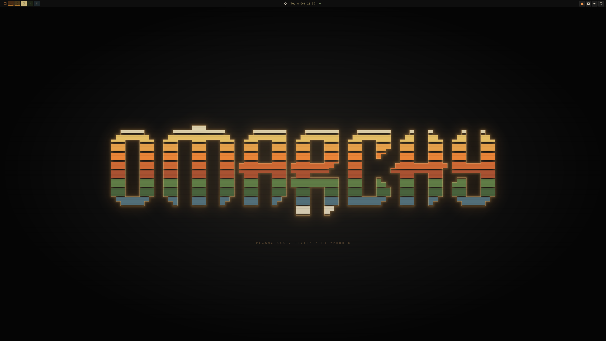
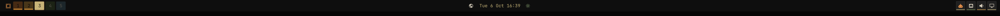
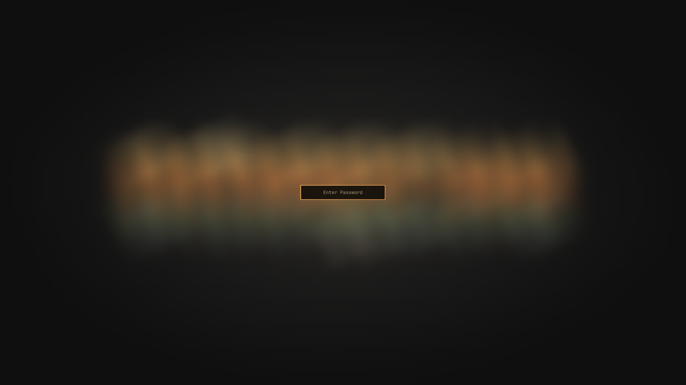

# Plasma 585

A warm, retro-futurist **Omarchy** theme built from vintage synthesizer
hardware, amber CRT phosphor, and plasma-discharge glow.

Near-black graphite panels, amber legends, synth-orange highlights, and dark
Heathkit green accents. Bright orange marks hover and selection; the bar carries
little synthesizer keycaps, and every dialog shares one coordinated palette.







## Highlights

- **Synth-key top bar** — rectangular workspace keycaps in orange, mustard,
  cream, olive, and muted blue. Brightness carries the active state: the focused
  workspace is full brightness, every inactive workspace is dimmed to 35%.
  Occupied workspaces keep a soft amber marker along the bottom edge; empty ones
  have none.
- **Flat center controls** — clock, weather, indicators, and the Omarchy menu
  keep their original flat backgrounds, tinted to theme text with pale amber
  hover/open-panel highlights instead of added keycaps.
- **Amber windows** — light-amber gradient borders with a soft amber edge shadow.
- **Glowing password dots** — the lock screen, login screen, and polkit prompt
  all mask input immediately with a pale amber core and amber halo.
- **Coordinated panels** — calendar, weather, audio, network, power, and the rest
  of the Quickshell panels use near-black surfaces with cream/amber text and
  orange hover, focus, and selected states.
- **Matching apps** — terminal palette, btop, Neovim, tmux chrome, lazygit, GTK
  accent, and an optional SDDM login theme.

## Requirements

- [Omarchy](https://omarchy.org) (Arch Linux + Hyprland + the Quickshell shell)
- `jq` — ships with Omarchy
- `yaru-icon-theme` — ships with Omarchy (the theme selects `Yaru-olive`)

## Install

Clone the repo anywhere, then run the installer:

```bash
git clone https://github.com/mshagirov/omarchy-plasma-585-theme.git
cd omarchy-plasma-585-theme
./install.sh
```

The installer:

1. copies the theme to `~/.config/omarchy/themes/plasma-585`,
2. installs the four bundled shell plugins,
3. enables them and applies the recommended bar layout (backing up
   `shell.json` first),
4. activates the theme and restarts the shell.

Options:

| Flag | Effect |
| --- | --- |
| *(none)* | Theme + plugins + recommended bar layout |
| `--no-layout` | Keep your current bar layout |
| `--plugins-only` | Install/enable plugins only |
| `--theme-only` | Install the theme only |

### Alternative: Omarchy's theme installer

```bash
omarchy theme install https://github.com/mshagirov/omarchy-plasma-585-theme.git
```

This works, but Omarchy refuses Lua files from themes cloned via git, so the
custom `hyprland.lua` (amber edge shadow and rounding) is dropped and
regenerated from `colors.toml`. The bundled shell plugins are **not** installed
by this path — use `./install.sh --plugins-only` afterward for the full look.
`install.sh` copies the theme instead of cloning it, which is why it preserves
the full styling.

### Optional: SDDM login screen

The theme ships a matching SDDM greeter. Install it system-wide with admin
rights:

```bash
sudo ./login/install-sddm.sh
```

It appears on the next login. Remove `/etc/sddm.conf.d/99-plasma-585.conf` to
restore the previous login theme.

## Uninstall

```bash
./uninstall.sh
```

Removes the theme and bundled plugins, restores the stock bar and stock
lock/polkit services, and backs up `shell.json` first.

## What's in the box

| Path | Purpose |
| --- | --- |
| `colors.toml` | Core palette (Omarchy consumes this) |
| `shell.toml` | Bar, controls, popups, lock, polkit, launcher tokens |
| `hyprland.lua` | Amber window borders, rounding, edge shadow |
| `icons.theme` | Selects the `Yaru-olive` icon theme |
| `backgrounds/` | Three 3840 × 2160 wallpapers |
| `artwork/` | Editable SVG sources + wallpaper build script |
| `bar-plugin/` | `plasma585.bar` — the synth-key bar |
| `workspaces-plugin/` | `plasma585.workspaces` — workspace keycaps |
| `lock-plugin/` | `plasma585.lock` — lock screen with glowing dots |
| `polkit-plugin/` | `plasma585.polkit` — authorization dialog |
| `login/` | SDDM greeter and installer |
| `install.sh` / `uninstall.sh` | Install and remove |

## Wallpapers

Cycle with `omarchy theme bg next`. Default is
`00-omarchy-synth-stripes.png`, a TR-808/Jupiter-8 inspired stack of orange,
mustard, cream, olive, and muted-blue layers around the Omarchy wordmark. Also
included: `01-plasma-chamber.png` (neon discharge tube) and
`03-omarchy-amber-tubes.png` (glowing tube outline wordmark).

Rebuild the wordmark wallpapers from source:

```bash
python artwork/build-wordmarks.py
```

## Customizing

- **Palette** — edit `colors.toml`, then re-apply with
  `omarchy theme set "Plasma 585"`.
- **Bar/control styling** — edit `shell.toml`; the shell picks it up on theme
  apply.
- **Window effects** — edit `hyprland.lua` (copied into the theme by
  `install.sh`).
- **Workspace keycaps** — edit
  `~/.config/omarchy/plugins/plasma585.workspaces/Workspaces.qml`. Saves reload
  live.
- **Bar widgets** — edit `~/.config/omarchy/plugins/plasma585.bar/`. Service
  plugin code changes need `omarchy restart shell`.

Bring your own plugins? Delete the `plasma585.*` folders under
`~/.config/omarchy/plugins/` and remove their entries from `shell.json`, then
keep just the palette.

## Credits & license

Theme code and artwork: MIT © 2026 Murat Shagirov.

The Omarchy angular wordmark is Omarchy's own artwork, used here to build
wallpapers.
